# Maa Meow基础指导篇
- 本文档旨在 15/20/25/30 分钟内教会你使用 Maa Meow 的基础操作（仅讨论后台模式）

## 异形UI会导致界面识别出现问题

## 请在游戏内拉到0

## 原理
**基于图像识别技术，****后台****虚拟显示器无界面运行，****无注入****不****修改数据****，****通常来说不会导致封号**
**注：****定时任务无法在锁屏状态启动**
**使用需要关闭护眼模式以及自定义字体，有概率让maa无法识别导致任务无法启动**

## 更新与下载

# 

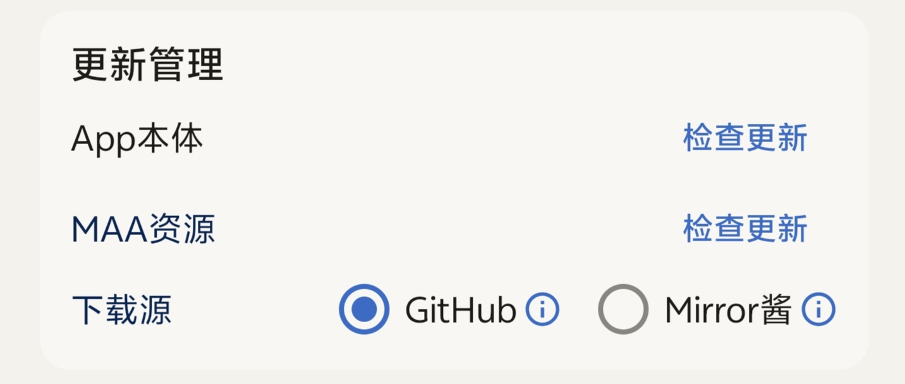
**G****ithub****由于****大部分****服务器在海外****，****偶尔能****直****连****下载，****除非你有一定的动手能力****，****否则不建议使用GitHub下****载（****群文件会第一时间更新最新的安装包，欢迎进群****拿取）**

# **关于提问的正确方式**
**请点击右上角齿轮进入设置****，****打开****调试模式****，复现一遍问题并录屏****，****然后导出日志文件，视频和日志一起发送，更容****易****获得解答****（****不开调试模式会导致日志信息太少，无法准确定位问题****。）**

# **基础****页面****认知**

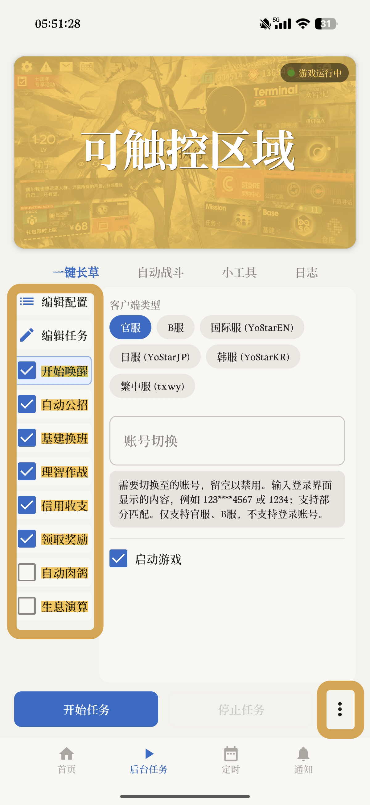
**黄色部分都为可触控区域****，****框选区域为功能键**

# 

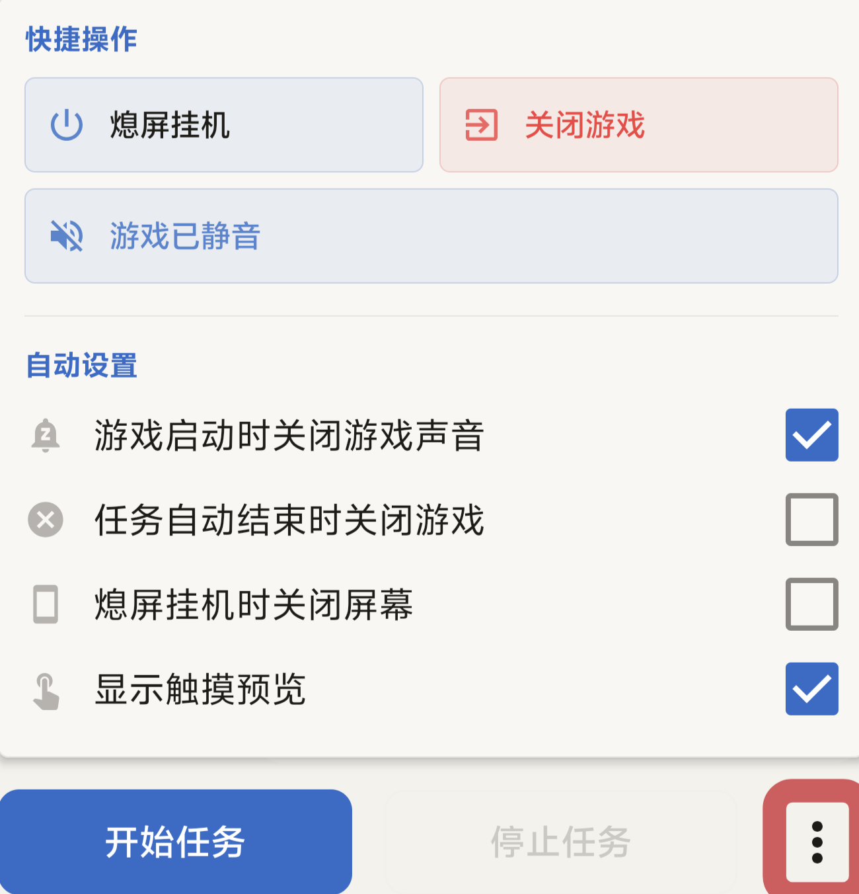

# 编辑配置与编辑任务
**编辑任务**
**点击****编辑任务****，可自由输入****以****更改任务名称****。点击****新增任务****，可添加一个任务模块（****修改完需点确定，否则无法****点击任务模块修改****任务设置****）**

### 编辑配置
**可自由组合任务顺序****，任务顺序从上到下，长按任务模块可以拖动以更换顺序（如果开始唤醒不在置顶****会导致无法启动游戏报错****）**

# 基础功能 一键长草

## 开始唤醒

**MAA最底层逻辑****，****不勾选****开始唤醒****什么都做不了**（不打开游戏，牛牛怎么给你挂）
左边任务模块**所有文字**都可以点击来打开任务设置，勾选才是选中任务
**操作逻辑**：**启动游戏****➡️选择账号➡️开始游戏**
**不需要自己打开明日方舟本体**
不要再问为什么一点开始任务，游戏就重新打开
**自动启动游戏****（手机里需要有明日方舟），****自动进入游戏****，****如果****明日方舟需要更新，****MAA会报错****无法启动，****请确保你的明日方舟是最新版**
**支持账号切换****，****支持服务器切换**** ，****账号切换和服务器切换均绑定在当前****选定****开始唤醒****，会在每次执行  ****开始唤醒**** 任务时都进行一次账号切换****服务器切换****操作。**

## 自动公招

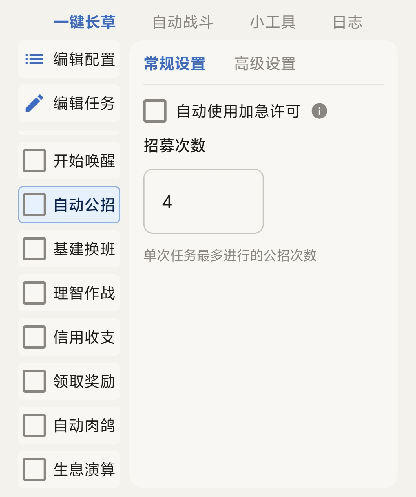
**如图，支持自动使用 加急许可，支持设置单次任务最大招募次数。****自动使用加急券选项不会被自动保存****，****每次使用任务需重新勾选**
**高级设置****：略**

## 基建换班

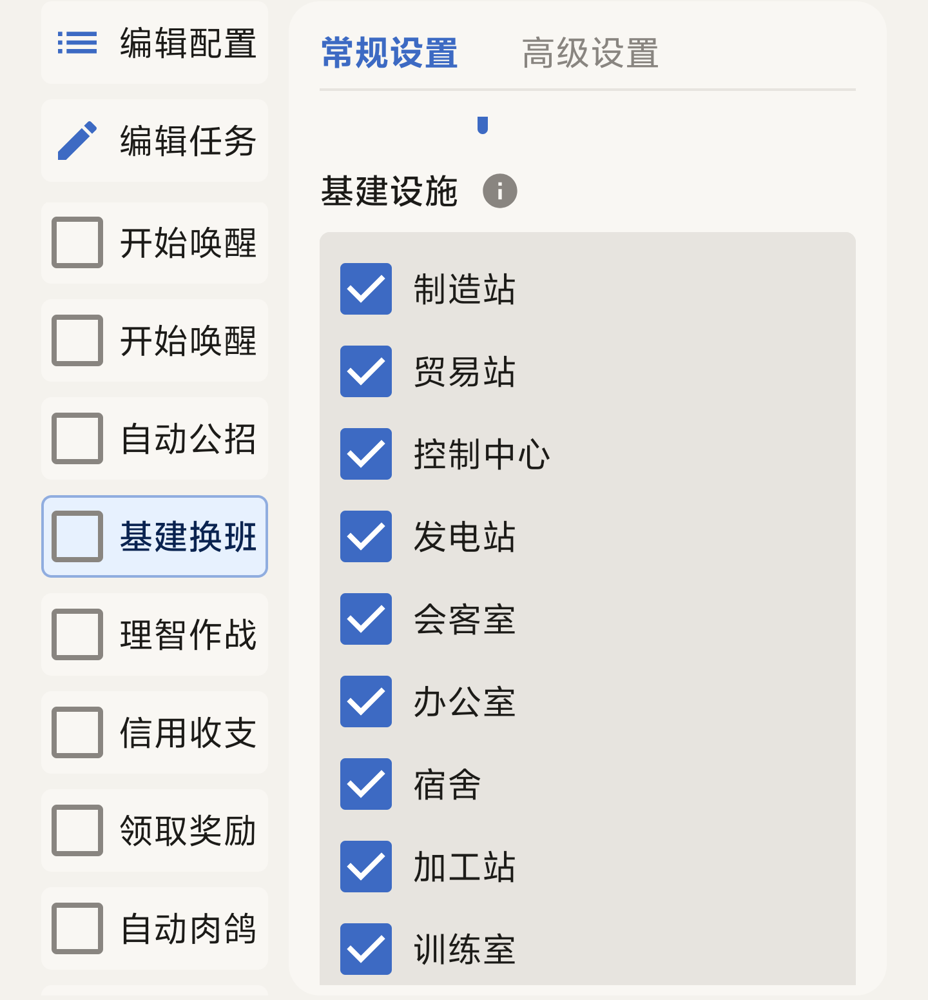

### 

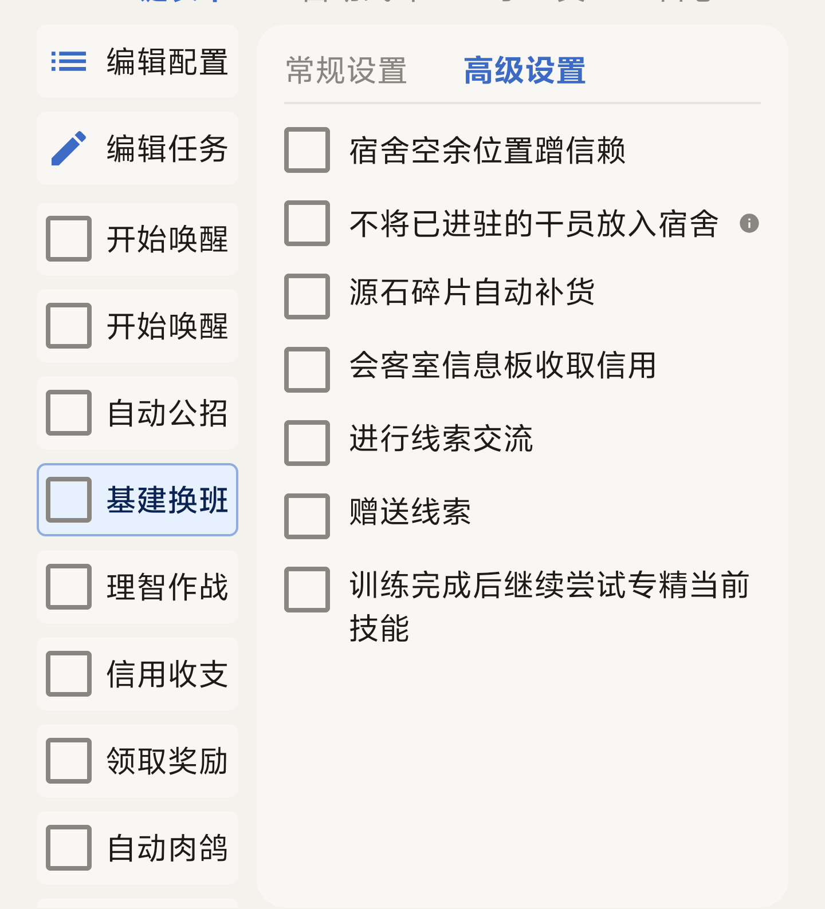

### 常规模式换班策略
- **自动计算并选择****单设施****内的最优解，支持所有通用类技能和特殊技能组合。**
- **自动识别经验书、赤金、源石碎片、芯片，分别使用相应的干员组合。**
- **自动按照 ****无人机用途****选择的方式使用无人机。**
- **自动识别心情进度条，将剩余心情百分比小于**
        **基建工作心情阈值****的干员进驻宿舍。**
- **可自行选择需要 MAA处理的设施类别，默认全选。**
- **会客室线索未收集齐全时****，****MAA不会将线索摆上线索板****，****为避免污染****MAA识别****线索****池。**

### 队列模式换班策略
- **该模式需要先在游戏内设置好预设队列，MAA meow会自动进行轮换。队列轮换跟游戏内队列轮换逻辑相同。若需要自定义轮换班次，请使用自定义基建换班**

### 自定义基建换班
- **略（****基础文档写这个干什么****，****详见MAA****pc用户手册****）**

## 理智作战

## 

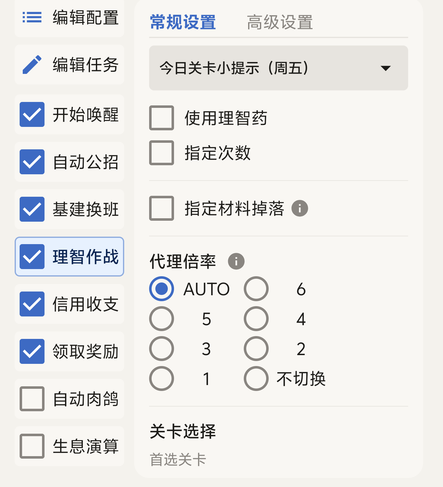

## **使用理智药****，****指定次数****，****指定材料掉落同时勾选的情况下满足任意一条，都会完成自动战斗****，****日常建议仅勾选其中之一****。**

## **代理倍率****auto自动识别关卡最大代理倍率保持最大代理倍率且使用理智药后理智不溢出**

## **不切换****即****不调整游戏类代理****倍率**

## 

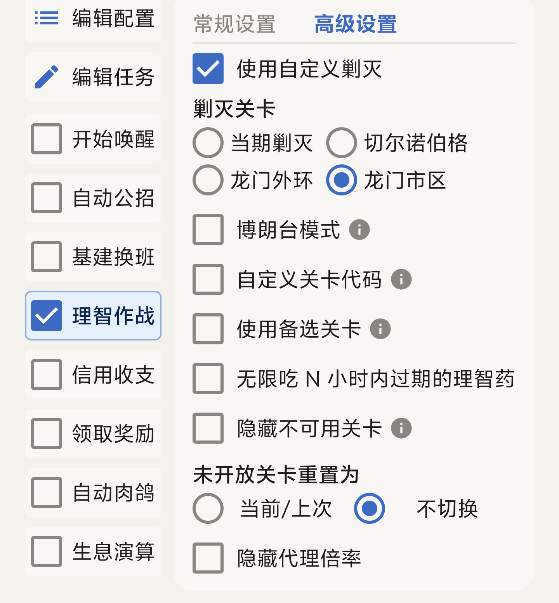
- **勾选自定义剿灭，可在当期剿灭****以及三个常驻剿灭（****龙门外环、龙门市区、切尔诺贝利****）****中自选一个开始****剿灭作战。**
- **勾选备用关卡****，****可在常规模式中选择首选关卡和备用关卡****，备选关卡根据当天关卡开放情况决定战斗关卡，即选择第一个开放关卡进行战斗。这是一个类似于日程表的功能，并不能当做关卡选择任务失败时的备用关卡。**
- **博朗台模式：等待理智恢复后再开始行动，在理智即将溢出时开始作战（无限吃药时不生效）**
- **若关卡选择中没有你需要的关卡，请在MAA 中选择 当前/上次，然后在游戏中手动定位关卡确保画面停留在右上角有关卡名和剩余理智，右下角有代理指挥和开始行动的关卡详情界面。**

## 信用收支

## 

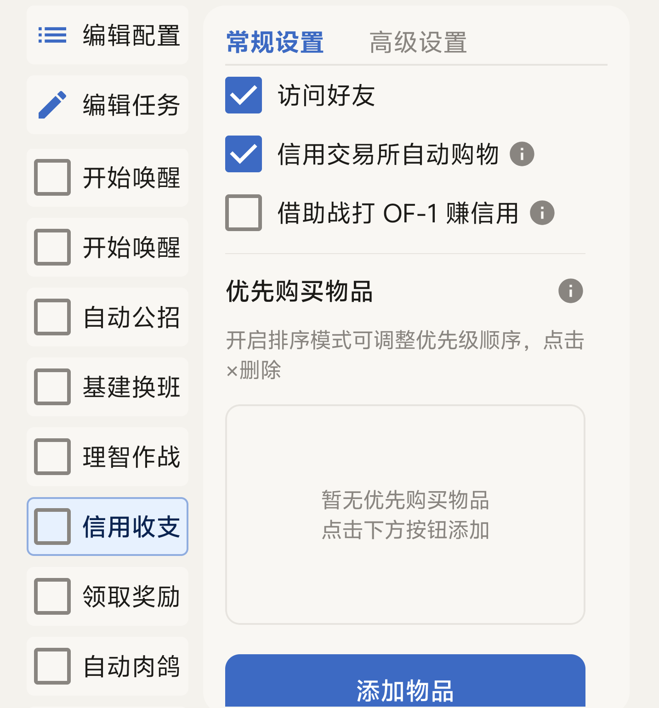

**如图，勾选后会自动访问好友获取信用点，并前往信用交易所购物。**
**借助战赚信用**：MAA 会使用助战干员通关一次火蓝之心 OF-1 关卡，请确认该关卡已解锁。

## 关卡选择为 当前/上次 时不会执行借助战任务
开启排序模式可调整优先级顺序，点击×删除优先购买列表中的物品会按顺序优先购买
黑名单物品不会被购买（除非信用溢出且启用强制购买）
借助战每日可获得额外信用点，但需要消耗好友支援次数

## 领取奖励

## 

## **注：如果版本更新出现maa无法领取的奖励，请手动领取并等待更新**

## 自动肉鸽

## **明日方舟每天凌晨四点闪断更新会导致****自动肉鸽****失败，请合理安排时间挂机，或者****添加****定时任务开始唤醒**** ****自动肉鸽****。**

## 

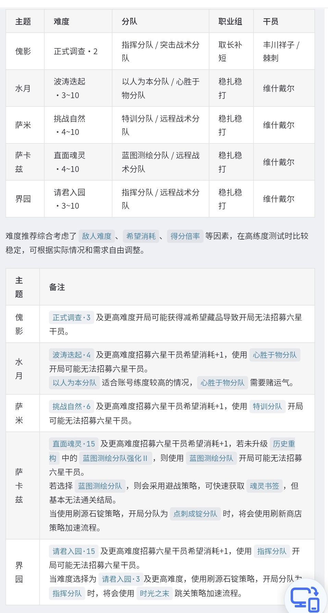

## **常规设置可切换集成战略主题****，****推荐分队****，****难度****，****策略****，****开局职业组**** **

## **难度max默认最高难度 ****MAA会在每次开启肉鸽时，都自动切换难度**

## **月度小队即为集成战略主界面****的****游览者小队****（****以界园肉鸽举例****）**

## 

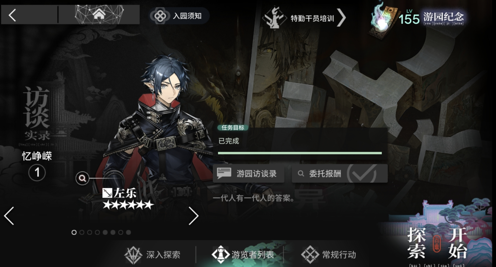

## 

**高级设置中勾选投资源石****锭，****会无视策略选择，强制投资源石****锭****，****可能导致没有足够的战力****推进难度**

## 生息演算

## **注：****新生息****演算****目前还处于开发中**
**明日方舟每天凌晨四点闪断更新会导致生息演算失败，由于生息演算重启锚点无法自动导航，请合理安排时间挂机，或者等待生息演算重启锚点功能优化。**
**注：****目前R****a****15挂机逻辑存在漏洞****，****具体表现为二十三费执行下初雪操作****，****导致初雪****（24费）****没下****。****如果遇到这种情况****，****先锋要求携带****精2****可露希尔或助战借满潜初雪****，即可****解决****。**
**无法刷生息演算？**
**解决办法：不要停留在这个界面开始运行生息演算任务**

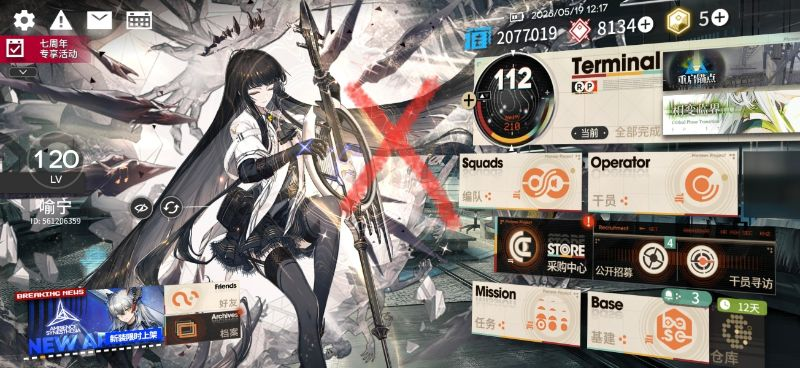
**请跳转至对应的RA-1****，RA-4或****RA-15（如下图显示）**
**（p****4****为第一期该显示界面）**

## 

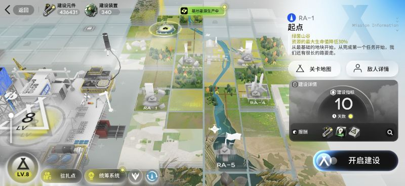
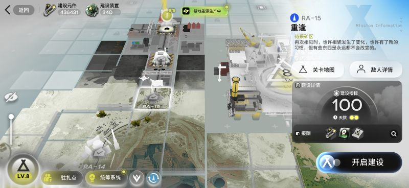
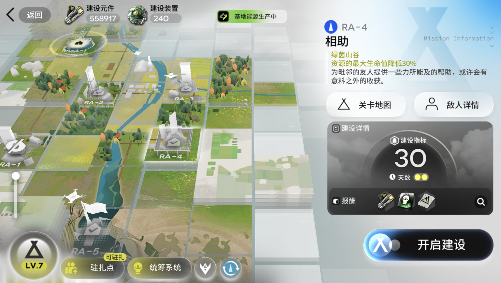

## 

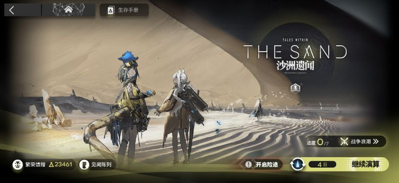

## ps：请注意阅读RA-1，RA-4或RA-15的关卡说明

## 

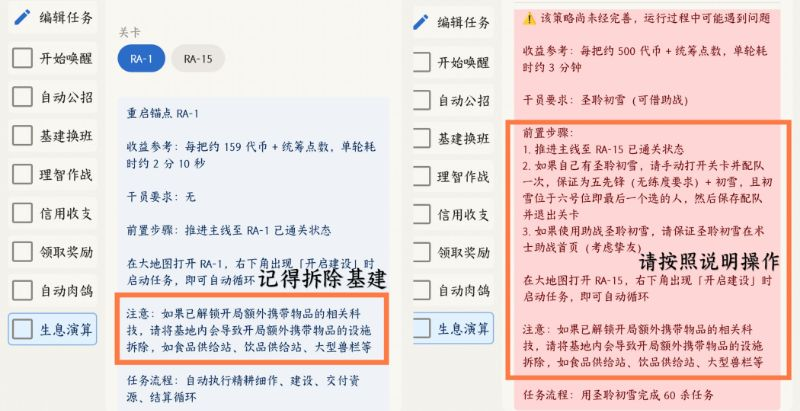

## 编队有额外道具的就是没有拆基建（附赠拆基建教程）

## 

## PPS：经部分群友体验

## **刷RA-1需要将分辨率调成720p（自行体验）**

## **刷RA-4需要将分辨率调至****1080p****，并解锁****筹划经营分队（即赤金分队）****需要保证维什戴尔在****六号位****，需要保证其他干员费用不高于维什戴尔，维什戴尔配置越高越好。如果使用助战维什戴尔，请保证维什戴尔在****狙击助战首页****（考虑挚友），请手动打开关卡编入****任意5个费用比维什戴尔低****的干员，六号位选择维什戴尔助战后确认招募，放弃本次建设并在开始建设处开始（保证队伍前五位有人且六号位为空）**

## **刷RA-15需要将分辨率调成1080p（需自行设置如下）**

## 

## 最后勾选上生息演算开始任务

## （❗️确认游戏是启动的且界面在关卡对应界面❗️）

## （❗️目前有正在运行的任务请点停止任务再点开始任务❗️）

如果刷第一期生息演算点击开始任务就失败的，
请检查自己是否是游戏有存档但MAA选择了无存档模式。如下图所示，点击日志查看红字提示。

# **基础操作**** ****自动战斗**

## 

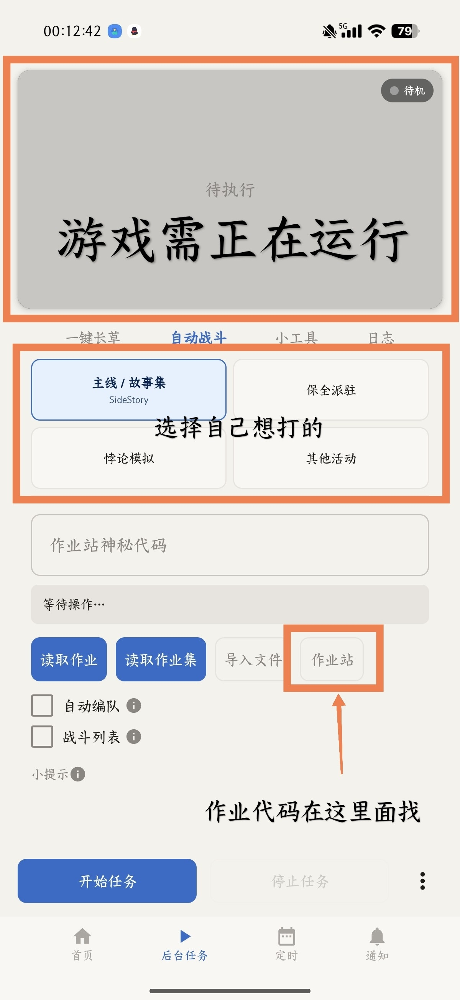
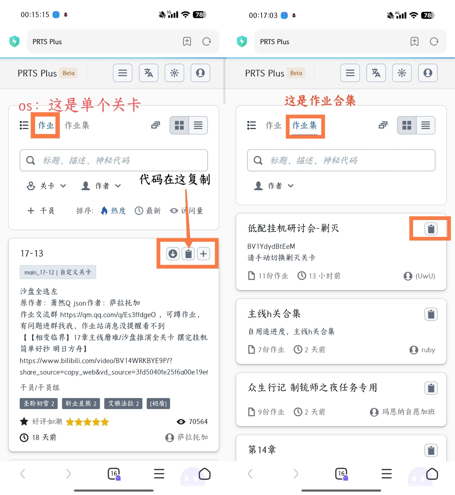
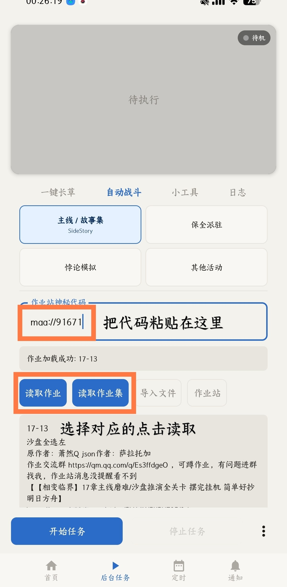

**勾选****自动战斗****，出现下列选项****（****使用编队****  ****忽略干员属性要求****  ****借助****战   ****补充低信赖干员****），****勾选****战斗列表****出现****使用理智药****选项以及战斗列表****。**
- **自动编队****可能无法识别特别关注干员**
- **忽略干员属性要求**** ****可能会导致战斗失败**
- **战斗列表****不会自动清理****，****可能会出现无法导航，导致运行失败**
- **战斗列表长按标签可拖动选择自动战斗顺序**

### 小提示
- **请确保战斗列表首位是需要战斗的关卡**
- **主线、故事集、SideStory:请在关卡界面的右下角存在「开始行动」按钮界面启动。**
- **保全派驻：resource/copilot 文件夹内置多份作业。请先手动编队，在右下角存在「开始部**
**署」按钮界面启动，可配合「循环次数」。**
- **悖论模拟：选好技能后，在技能选择界面存在「开始模拟」按钮界面启动，1/2 星干员（无技能）在右下角存在「开始模拟」按钮界面开始。若使用「战斗列表」，请从干员列表「等级/稀有度」筛选下启动。**
- **使用好友助战时，请关闭「自动编队」和「战斗列表」，手动选择干员后，在编队界面右下角存在「开始行动」按钮界面启动。**
